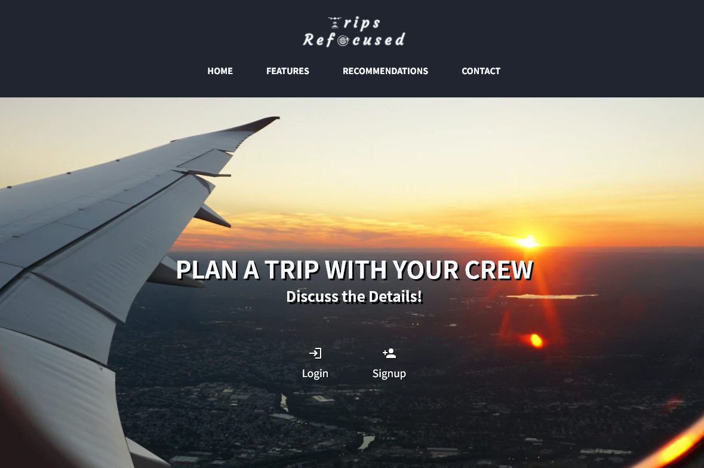
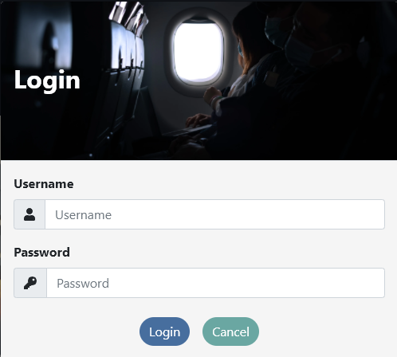
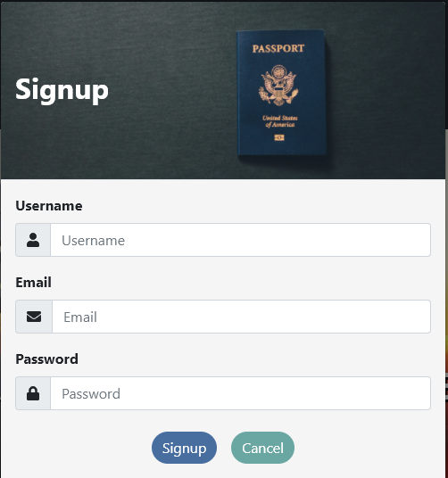
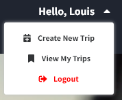
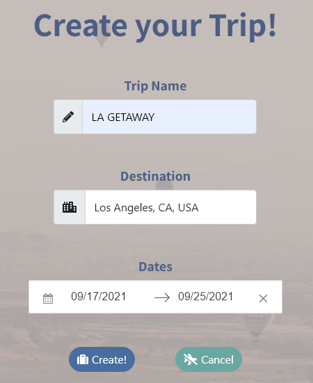
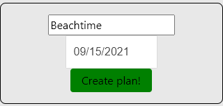
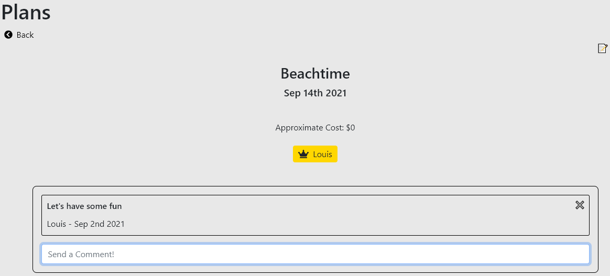
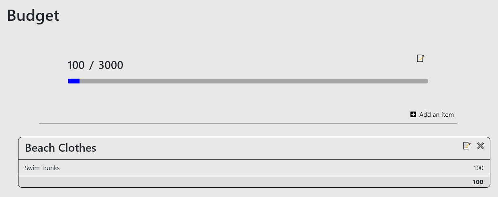
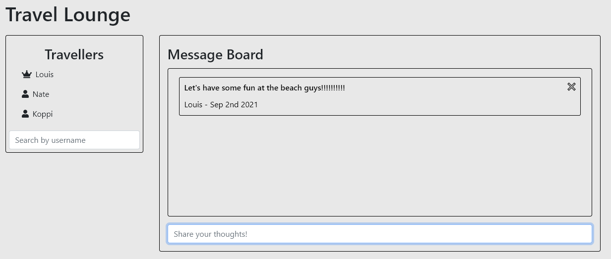

# Trips Refocused

Trips Refocused deployed <a href="https://trips-refocused.herokuapp.com/">here</a>.


[](https://opensource.org/licenses/MIT)

## Table of Contents

- [Instructions](#instructions)
- [Contributors](#contributors)
- [Questions](#questions)
- [License](#license)

## Description:

```
AS A world traveler,
I WANT a user friendly website that allows me to coordinate travel plans with co-travellers,
SO THAT we can all remain organized.
```

<a href="https://trips-refocused.herokuapp.com/">Trips Refocused</a> is a web application where users can create trips for them and their friends. Users can create, edit, and delete their trips. Each trip has a budget management tool specific to each user. Users can also creat, edit, and delete plans for the trip. Signup today and send an invitation to your friends!

## Instructions

1. Follow this <a href="https://trips-refocused.herokuapp.com/">link</a> to navigate to the application



2. If you have an account log in,



otherwise creat an account.



3. After logging in you can create a trip using the `Get Started` button, or click under your name in the navbar.



4. When creating a trip, the following information is needed:
    * Trip name
    * Destination
    * Departure & Return dates.

    

5. Once your trip is created it will be added to your profile, and you will be navigated to the trips page.
6. If you click on the `Plan` tab, you can view all plans for the trip and create a plan for the trip.



7. Once the plan is created you can click on it to add a description and estimated cost of the plan
8. You can also comment on a plan as well



9. Clicking on the `Budget` tab will navigate you to your budget page for the trip, each user on a trip have their own budget page.
10. Here you can add budget categories, and each budget category can have budget items added to it.
11. The total cost of your budget is dynamically updated.



12. Clicking on the `Lounge` tab will navigate you to the message board for the trip
13. Here you can leave comments on the trip as well as leave comments on other users comments.



14. The `Search by Username` box allows you to add a user to your trip.
15. These users will be able to add plans and comments to the trip.
16. Only the user that created a trip, or a plan will be able to see the delete button for that trip or plan.

## Contributors

<a href="https://github.com/TheHebi">Kaleb Muse</a> - Backend Developer

<a href="https://github.com/rhwlffk1028">Kevin Choi</a> - Front End Developer

<a href="https://github.com/kkolyvek">Koppi Kolyvek</a> - Front End Developer

<a href="https://github.com/TheHebi">Nathaniel Turcotte</a> - Back end Developer

## Quesions

If you have any questions, contact me <a href="https://github.com/TheHebi" target="_blank">here</a>, or send me an email at nturcotte8@live.com.

## License

This project uses the MIT License